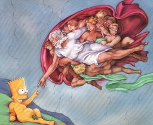



## Fast Graphics Filters

### Description

Shows how to perform image filtering. Fast and easy 40 great graphics filters. Includes sharpen, blur, emboss, contour, greyscale, stucki, aqua, gamma, contrast, saturation, erode and many others. Improve your graphics applications!
 
### More Info
 

             |
---                |---
**Submitted On**   |2001-08-17 14:46:18
**By**             |[Manuel Augusto Santos](https://github.com/Planet-Source-Code/PSCIndex/blob/master/ByAuthor/manuel-augusto-santos.md)
**Level**          |Intermediate
**User Rating**    |5.0 (105 globes from 21 users)
**Compatibility**  |VB 6\.0
**Category**       |[Graphics](https://github.com/Planet-Source-Code/PSCIndex/blob/master/ByCategory/graphics__1-46.md)
**World**          |[Visual Basic](https://github.com/Planet-Source-Code/PSCIndex/blob/master/ByWorld/visual-basic.md)
**Archive File**   |[Fast Graph248258172001\.zip](https://github.com/Planet-Source-Code/manuel-augusto-santos-fast-graphics-filters__1-26303/archive/master.zip)

